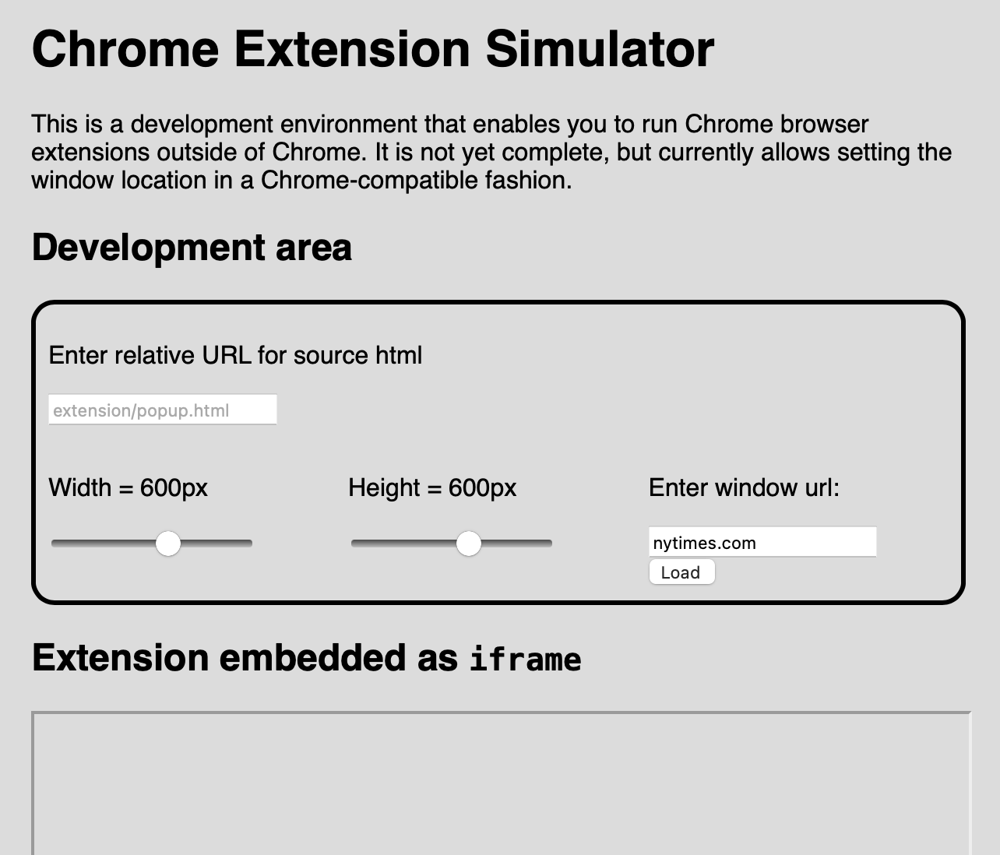

# chrome-extension-simulator

Chrome extension simulator is a debugging environment web app for developing popup Chrome extensions outside of Chrome, albeit not even close to feature-complete.



## Usage

1. Add [`chrome-simulator.js`](chrome-simulator.js) directly into your project.

2. Take your top-level code and instead call it using `ChromeExtensionSimulator.run`. For example,
    ```js
    // before
    chrome.tabs.query({active: true, currentWindow: true}, function(tabs) {
        const url = tabs[0].url;
        console.log(url);
    }
    ```

    ```js
    // after
    ChromeExtensionSimulator.run(() => {
        chrome.tabs.query({active: true, currentWindow: true}, function(tabs) {
            const url = tabs[0].url;
            console.log(url);
        }
    });
    ```
    This will not affect how your code runs; it merely allows the simulator to work.

3. Place [`index.html`](index.html) in the same directory or in an enclosing directory.

4. Host `index.html` locally by running `make` ([this](Makefile) is the Makefile).

That's it!
